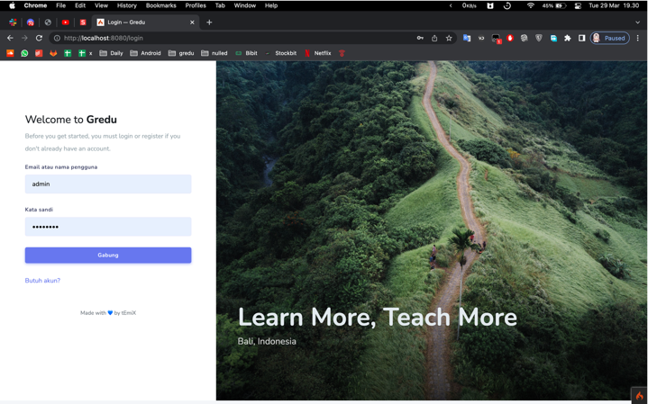
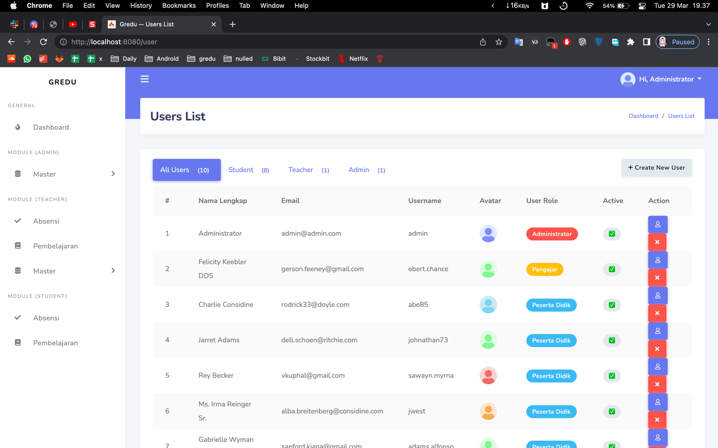

# CodeIgniter 4 Application Starter



## Require Install
	- xampp / mamp
	- composer
	- yarn


## SET UP
---
run on terminal `composer install`

### Template
	- download : https://github.com/stisla/stisla/archive/refs/heads/master.zip
	- move to `public/template/` 
	- terminal `cd public/template/ && yarn install`


### Migrate Database
open terminal / cmd 
```shell
 by script run : ./init_db.sh
```
 or manual
```shell
 php spark migrate:rollback
 php spark migrate
 php spark db:seed CoreSeeder
```

### .env file
rename `env` to `.env` and edit db connection


### admin login
```
username : admin
password : admin123
```